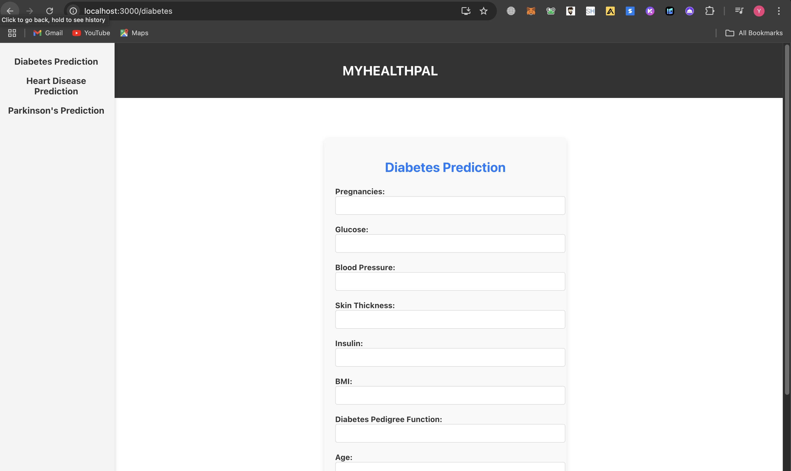
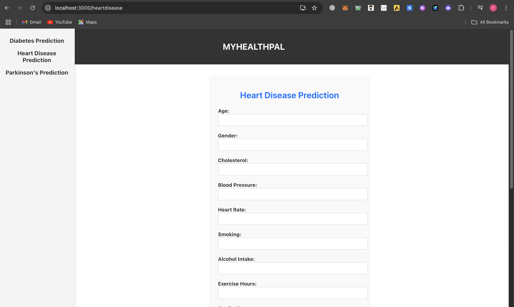
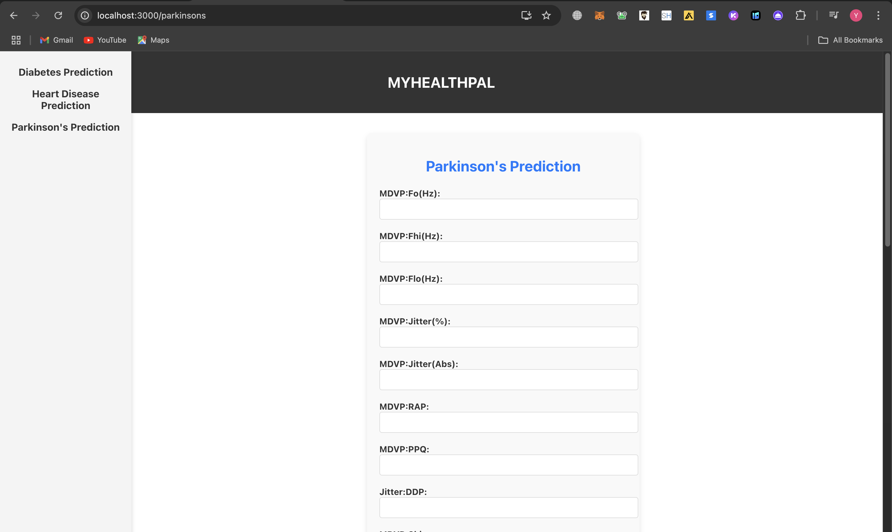

# MyHealthPal
A Machine Learning-based healthcare tool to predict the likelihood of Diabetes, Heart
disease, and Parkinson’s disease using user-provided data. The model analyzes diverse datasets, including medical
history and biometric measurements, to generate accurate predictions, enabling early detection and informed medical
decision-making
## Screenshots

